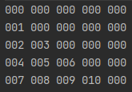
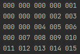
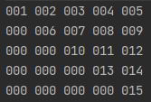
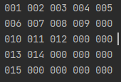

# 2021.04.04.Sun
배운거 끄적이기   
한 번에 합격 해야지이
## for each 문
시험에 출제될 가능성 있음
```java
for (type var: iterate) {
    body-of-loop
}
```
iterate에는 배열 및 arrayList 가능   
var는 제어변수
### 사용 예시
```java
for(int k: a){
    System.out.printf("%4d\n", k);
}
```
a 배열에 있는 값들의 개수 만큼 for 문 돌거임   
k(제어변수)에는 a 배열에 들어있는 값들을 찾아감   
제어변수 타입은 배열과 맞춰야 함 
## while
초기식, 조건식, 증감식 을 꼭💥 파악하기   
특히 증감식이 들어가자 마자 있는지, 내용을 다 하고 나서 있는지에 따라 초기값, 조건식이 달라짐
## 1차원 배열
배열의 크기가 n 이면 배열의 인덱스는 0 부터 최대 n-1까지 이다
```java
int[] a = new int[5]; // 인덱스 값은 0 ~ 4
int[] a = {90, 100, 80, 70, 60, 50, 20}; // 초기값 주는 방법
```
## 2차원 배열
우리는 항상 행과 열을 나눠서 그리지만 실제 저장된 모양을 한 줄임
### 2차원 배열 사용 법
```java
int[][] a = new int[3][5]; // 3행 5열
for(i = 0; i < 3; i++) { // 행 : 3 = a.length
    for(j = 0; j < 5; j++) { // 열 : 5 = a[i].length
        a[i][j] = i + j; // 0 - 0,1,2,3,4 | 1 - 0,1,2,3,4 | 2 - 0,1,2,3,4
        System.out.printf("%d", a[i][j]);
    }
    System.out.println();
}
```
### 2차원 배열의 크기 표현 법
**시험 가능성 있음**   
건물이 크다고 판단하는 기준은 아마도 높이일 것   
그러므로...
* 행(층) : a.length
* 열(층 별 칸 수) : a[행].length
### 2차원 배열 단축 사용 법
```java
// 이차원 배열의 가장 간결한 출력 방법
for(int i[]: a) { // 전체 층을 가져와서
    for(int j: i) { // 방 수는 몇 개?
        System.out.printf(" %3d ", j);
    }
    System.out.println();
}
```
### 가변 배열
자바는 열의 개수가 달라도 가변 배열을 지원함
```java
int[][] a = { // 칸의 수가 달라도 가변 배열 지원함
    {1, 2, 3, 4, 5, 6},
    {10, 20, 30, 40, 50},
    {100, 200},
    {1, 2, 3}
};
```
### 2차원 배열을 사용한 다양한 직각 삼각형 그리기
1. 직각 삼각형 1번   
   
```java
public static void main(String[]args){
    int k = 1;
    for(i = 0; i < 5; i++){
        for(j=0;j<i; j++){
            a[i][j]=k++;
        }
    }
}
```
2. 직각 삼각형 2번   
   
```java
public static void main(String[]args){
    int k = 1;
    for(j = (0+4)-i; j < 5; j++) {
        for(j=0;j<i; j++){
            a[i][j]=k++;
        }
    }
}
```
3. 직각 삼각형 3번   
    
```java
public static void main(String[]args){
    int k = 1;
    for(j = i; j < 5; j++) {
        for(j=0;j<i; j++){
            a[i][j]=k++;
        }
    }
}
```
4. 직각 삼각형 4번   

```java
public static void main(String[]args){
    int k = 1;
    for(j = 0; j <= (0+4)-i; j++) {
        for(j=0;j<i; j++){
            a[i][j]=k++;
        }
    }
}
```
## 문자열 String
### 문자열 거꾸로 출력하기💥
```java
String str = "information~~~"; // 인덱스 0 ~ 13 : 총 14
int len = str.length(); // 1 부터 체크하는거임.. 배열 인덱스랑 좀 다름
char[] c = new char[len];
int i;

System.out.println(str);
len--; // 13
for(i = len; i >= 0; i--) {
    c[len - i] = str.charAt(i); // charAt() : 해당되는 위치의 문자를 가져와라
}

for(char k: c) {
    System.out.printf("%c", k);
}
```
## 클래스
클래스를 이용해서 객체를 생성할 때 초기값을 주지 않으면 *기본값*이 들어감
> String = null   
> int = 0   
> float = 0.0f, double = 0.0   
> boolean = false
### 구성요소
1. 속성
2. 메소드
3. 생성자 : 객체를 만들어내는 기능(역할) 기본 제공 ... 
### 객체 생성
```java
Employee employee = new Employee();
Employee employee2 = new Employee();
Employee employee3 = new Employee();
```
힙(heap)에 생성됨 - 힙은 동적 공간임   
employee, employee2, employee3 은 객체가 생성된 위치(힙)의 주소를 가지고 있음 + 객체를 가리킴  
Employee() 가 생성자
### 객체 안의 값 변경
```java
public static void main(String[]args){
    myVal = change(myVal); // 객체를 전달하면 객체 안의 값들이 전달되는 효과        
}
static AAClass change(AAClass val) { // 전달받은 객체 안의 두 값을 교환
    int temp;

    temp = val.idNum1;
    val.idNum1 = val.idNum2;
    val.idNum2 = temp;

    return val;
}
```
## 기타
### 강제 형변환
나눗셈 할 때 소수점까지 하려면 분자, 분모 중 하나는 반드시 강제 형변환이 필요   
둘 다 강제 형변환 해도 상관 없음